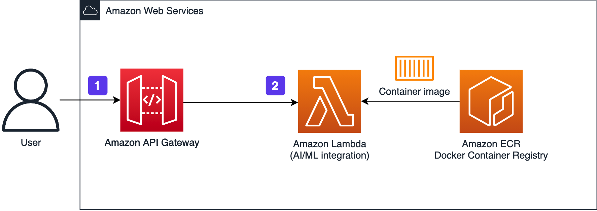
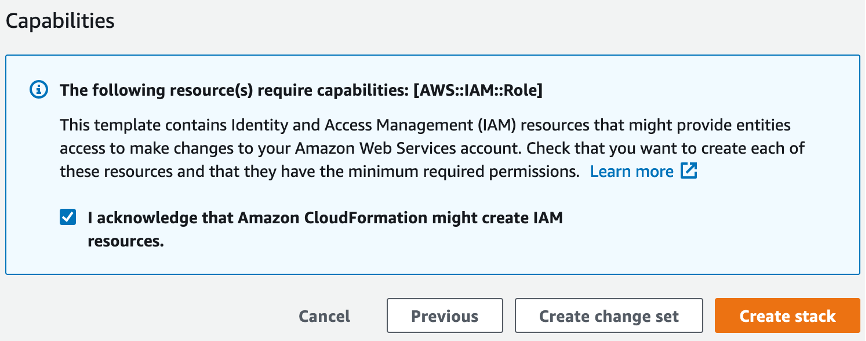

## 背景

本部署指南详细描述了如何在云上使用 Amazon CloudFormation 模板部署 **AI 解决方案合集 - 通用文字识别** 解决方案

AI 解决方案合集提供了一系列云上 AI 功能，这些 AI 功能都以 API 接口的形式提供，客户可以直接调用 API 接口或使用软件开发工具包（SDK）调用其服务。其中，通用文本识别方案基于AI文本识别技术，自动完成各类场景中文字的识别，并返回文字在图片中的坐标位置等信息以便于客户进行比对或结构化等操作，对客户的工作流程和业务流程进行了极大的改进，可满足医疗、金融、政务、法务、教育等行业文档快速录入的需求，有效降低企业人力成本，提高信息录入效率。目前支持识别简体/繁体中文，英文和数字。可将图片上的文字识别为文本，并返回对应文字的坐标与置信度，并且本解决方案还增强了对中文语言的处理与识别能力，结合精准的语言模型和大词库，如香港增补字符集（HKSCS）等大字符集识别，从而提高输入转化效率。

## 解决方案描述
用户基于 Amazon Cloudformartion 部署后可以通过调用 HTTP(s) 或 API接口等 方式使用。其中，通过 Amazon API Gateway 创建的 REST API 接口向用户提供 AI 调用服务，用户可以将请求（图片或文本）通过  **HTTP POST**  方式发送请求到 Amazon API Gateway，之后由 Amazon API Gateway 调用 Lambda 完成 AI 文字识别过程并将识别文字及坐标等结果（JSON格式数据）返回给调用端。
本方案使用 Lambda 、 Amazon API Gateway 等无服务架构方案，用户无需担心在云中或本地管理和运行服务器或运行时。只需按实际使用量支付费用。

## 使用场景
本解决方案具有中文识别精度（准确率）高、价格低、处理速度快、可私有化部署等优势，能有效保护用户隐私数据。可应用于纸质文档电子化，证件识别，内容审核等多种场景，大幅提升信息处理效率。

## 系统架构
本解决方案架构为基于 Amazon Lambda 的架构实现， Amazon API Gateway 将接收到的用户请求直接发送给 Lambda 函数，Lambda 函数通过调用存储在 Amazon EFS 里面的模型完成推理计算，最后将结果返回给调用端。

用户或程序发送 API 请求至 Amazon API Gateway，请求 payload 中需要包含被处理的图片或文字信息，Amazon API Gateway 接收到 HTTP 到请求后，将请求数据发送给对应的 Lambda 函数从而实现推理过程，并将推理结果（通常为 JSON 格式数据）返回。

### 架构图
此解决方案可在由西云数据运营的 Amazon Web Services（宁夏）区域或由光环新网运营的Amazon Web Services（北京）区域中部署，也可部署在 Amazon Web Services 其他海外区域。



### 组件

Amazon API Gateway

- 本解决方案使用API Gateway路由用户的 **HTTP POST** 请求；
- 同时还可使用API  Gateway中自定义域名来关联用户ICP备案的域名；用户的 **HTTP POST** 请求中可携带图片的base64编码；
- API Gateway中还可以进行密钥设置来对 **HTTP POST** 请求方进行授权；还通过API Gateway将用户的请求转发到 Amazon Lambda 进行推理运算

Amazon Lambda (基于 Lambda 的架构类型)

- Lambda函数负责处理用户的请求并进行推理运算。

Amazon EFS

- Amazon EFS 存储基于Lambda预训练的机器学习模型，Lambda 函数通过调用存储在 Amazon EFS 里面的模型完成推理计算，最后将结果返回给调用端。


## 快速部署
以下部署说明适用于在由西云数据运营的Amazon Web Services（宁夏）区域或由光环新网运营的Amazon Web Services（北京）区域中部署的解决方案，也适用于 Amazon Web Services 其他海外区域。您可以使用以下链接快速启动一个Amazon CloudFormation堆栈来部署和管理整个方案。

### 部署前提（中国区域）
本解决方案使用 Amazon API Gateway来接收API 调用请求，所以如果您希望在 北京区域 提供无需身份验证即可访问的 API 请求，则需要申请并确保您的Amazon Web Services账号已通过Internet Content Provider (ICP) 备案，80/443端口可以正常开启，具体流程参见[这里](https://s3.cn-north-1.amazonaws.com.cn/sinnetcloud/ICP+recordal/ICP%E5%A4%87%E6%A1%88%E8%AF%B4%E6%98%8E.pdf)。

### 登录到您的账户

使用具有必需权限（例如：*APIGatewayInvokeFullAcces*，*LambdaBasicExecutionRole*, *LambdaVPCAccessExecutionRole* 等）的IAM用户角色，通过 https://console.amazonaws.cn 登录到您的中国区域 Amazon Web Services 账户，非中国区域请通过 https://console.aws.amazon.com 登录。

### 启动 CloudFormation 堆栈

打开 Amazon Web Services 管理控制台（如果还没登录则会先跳转到登录页面，登录后进入模板启动页面）。您可以使用控制台右上方的区域选择链接，选择要部署的区域。然后，单击下面的链接以启动 Amazon CloudFormation 模板。

| 快速启动链接                                                                                                                                                                                                                                               | 描述                                        |
| -------------------------------------------------------------------------------------------------------------------------------------------------------------------------------------------------------------------------------------------------------- | ------------------------------------------- |
| [北京区域](https://cn-north-1.console.amazonaws.cn/cloudformation/home?region=cn-north-1#/stacks/create/template?stackName=AIKitsInferOCRStack&templateURL=https://aws-gcr-solutions.s3.cn-north-1.amazonaws.com.cn/Aws-gcr-ai-solution-kit/v1.0.0/AIKits-Infer-OCR-Stack.template)            |  在**北京**区域部署AI Solution Kit - 通用文字识别解决方案  |
| [宁夏区域](https://cn-northwest-1.console.amazonaws.cn/cloudformation/home?region=cn-northwest-1#/stacks/create/template?stackName=AIKitsInferOCRStack&templateURL=https://aws-gcr-solutions.s3.cn-north-1.amazonaws.com.cn/Aws-gcr-ai-solution-kit/v1.0.0/AIKits-Infer-OCR-Stack.template)        |  在**宁夏**区域部署AI Solution Kit - 通用文字识别解决方案  |
| [海外区域](https://console.aws.amazon.com/cloudformation/home?region=us-east-1#/stacks/create/template?stackName=AIKitsInferOCRStack&templateURL=https://aws-gcr-solutions.s3.amazonaws.com/Aws-gcr-ai-solution-kit/v1.0.0/AIKits-Infer-OCR-Stack.template)                                  |  在**海外**区域部署AI Solution Kit - 通用文字识别解决方案  |

| 模版链接                                                                                                                                                                       |
| ----------------------------------------------------------------------------------------------------------------------------------------------------------------------------- |
| [AIKits-Infer-OCR-Stack.template](https://aws-gcr-solutions.s3.amazonaws.com/Aws-gcr-ai-solution-kit/v1.0.0/AIKits-Infer-OCR-Stack.template) |

在默认情况下，该模板将在您登录控制台后后默认的区域启动。若需在指定的 Amazon Web Service 区域中启动该解决方案，请在控制台导航栏中的区域下拉列表中选择。

在创建堆栈页面上，确认Amazon S3 URL文本框中显示正确的模板URL，然后单击Next按钮。


在Stack name文本框中填写/确认堆栈名称，并确认参数是否填写正确，然后单击Next按钮。

**参数说明**

|  参数名称   |  默认值 |  描述 |
|  ----------  | ---------| -----------  |
| **customStageName**  | prod | API网关（URI）中的第一个路径字段。请参考：[阶段变量](https://docs.aws.amazon.com/zh_cn/apigateway/latest/developerguide/stage-variables.html)|
| **customAuthType**    | AWS_IAM    | API网关的认证方式. 默认为 *AWS_IAM* ，将自动使用 [IAM](https://docs.aws.amazon.com/zh_cn/apigateway/latest/developerguide/permissions.html) 权限控制对 API 的访问。也可选择 *NONE* 即无权限认证方式（不安全的），在部署解决方案后用户需要手动在 API Gateway 控制台配置所需的[资源访问策略](https://docs.aws.amazon.com/zh_cn/apigateway/latest/developerguide/apigateway-control-access-to-api.html)。 |
| **modelType**    | Standard    | 可选择的 OCR 预训练模型，请参考模型说明 |

**模型说明**

|  名称  |  描述 |
|  ----------  | ---------|
| Standard | 包含通用规范汉字库，支持常用简、繁体中文、英文、数字和常用符号，识别准确率高 |
| Lite | 包含通用规范汉字库，支持常用简、繁体中文、英文、数字和常用符号，识别效率高 |
| Standard(Apache) | 基于开源社区模型训练，支持常用简、繁体中文、英文、数字和常用符号，识别准确率高 |
| Lite(Apache) | 基于开源社区模型训练，支持常用简、繁体中文、英文、数字和常用符号，识别效率高 |


在审核页面上，查看并确认设置。确保选中确认模板将创建Amazon Identity and Access Management（IAM）资源的复选框。



单击 Create stack 按钮以部署堆栈。
您可以在Amazon CloudFormation控制台的状态列中查看堆栈的状态。您应该在大约15分钟内看到状态成为**CREATE_COMPLETE**。


在堆栈创建成功后，可在Amazon CloudFormation的Outputs标签页中看到以 **aikitsInvokeURL** 为前缀的记录，请记住后面的URL。


## 开始使用

### 调用 URL

您可以在 Amazon CloudFormation 的 Outputs 标签页中看到以 **aikitsInvokeURL** 为前缀的记录的 URL 。

### REST API接口参考

- HTTP 方法: `POST`

- Body 请求参数

| **名称**  | **类型**  | **是否必选** |  **说明**  |
|----------|-----------|------------|------------|
|url&nbsp;&nbsp;&nbsp;&nbsp;       |*String*     |与 img 参数二选一，优先级高于 img|图像的 URL 地址。支持 HTTP/HTTPS 和 S3 协议。要求图像格式为 jpg/jpeg/png/bmp ，最长边不超过 4096px。|
|img       |*String*     |与 url 参数二选一|进行 base64 编码的图像数据|

- 请求 Body 示例

``` json
{
  "url": "https://aikits.demo.solutions.aws.a2z.org.cn/img/ocr-2.jpg"
}
```

``` json
{
  "img": "/9j/4AAQSkZJRgABAQEAYABgAAD/2wBDAAgGBgcGBQgHBwcJCQgKDBQNDAsLDBkSEw8UHRofHh0aHBwgJC4nICIsIxwcKDcpLDAxNDQ0Hyc5PTgyPC4zNDL/……"
}
```

- 返回参数

| **名称**  | **类型**  |  **说明**  |
|----------|-----------|------------|
|words    |*String*   |识别文本字符串内容|
|location |*JSON*     |识别文本在图像中的的坐标值，包含 top，left，width，height的整数值|
|score    |*Float*   |识别文本的置信度值，为0到1区间内 Float 型数值|

- 返回示例
``` json
[
    {
        "words": "香港永久性居民身份證",
        "location": {
            "top": 18,
            "left": 148,
            "width": 169,
            "height": 17
        },
        "score": 0.9923796653747559
    },
    {
        "words": "HONG KONG PERMANENTIDENTITYCARD",
        "location": {
            "top": 36,
            "left": 71,
            "width": 321,
            "height": 17
        },
        "score": 0.9825196266174316
    }

]
```

###  请求代码示例

以下代码示例均为无认证方式部署模式后的测试方式，如果您选择 AWS_IAM 方式部署本方案，请参考 Postman 方式。

**cURL**
``` bash
curl --location --request POST 'https://xxxxxxxxxxx.execute-api.xxxxxxxxx.amazonaws.com/prod/ocr' \
--header 'Content-Type: application/json' \
--data-raw '{
  "url":"https://aikits.demo.solutions.aws.a2z.org.cn/img/ocr-2.jpg"
}'
```

**Python (requests)**
``` python
import requests
import json

url = "https://xxxxxxxxxxx.execute-api.xxxxxxxxx.amazonaws.com/prod/ocr"

payload = json.dumps({
  "url": "https://aikits.demo.solutions.aws.a2z.org.cn/img/ocr-2.jpg"
})
headers = {
  'Content-Type': 'application/json'
}

response = requests.request("POST", url, headers=headers, data=payload)

print(response.text)

```

**Java (OkHttp)**
``` java
OkHttpClient client = new OkHttpClient().newBuilder()
  .build();
MediaType mediaType = MediaType.parse("application/json");
RequestBody body = RequestBody.create(mediaType, "{\n  \"url\":\"https://aikits.demo.solutions.aws.a2z.org.cn/img/ocr-2.jpg\"\n}");
Request request = new Request.Builder()
  .url("https://xxxxxxxxxxx.execute-api.xxxxxxxxx.amazonaws.com/prod/ocr")
  .method("POST", body)
  .addHeader("Content-Type", "application/json")
  .build();
Response response = client.newCall(request).execute();
```

**PHP (curl)**
``` php
<?php

$curl = curl_init();

curl_setopt_array($curl, array(
  CURLOPT_URL => 'https://xxxxxxxxxxx.execute-api.xxxxxxxxx.amazonaws.com/prod/ocr',
  CURLOPT_RETURNTRANSFER => true,
  CURLOPT_ENCODING => '',
  CURLOPT_MAXREDIRS => 10,
  CURLOPT_TIMEOUT => 0,
  CURLOPT_FOLLOWLOCATION => true,
  CURLOPT_HTTP_VERSION => CURL_HTTP_VERSION_1_1,
  CURLOPT_CUSTOMREQUEST => 'POST',
  CURLOPT_POSTFIELDS =>'{
  "url":"https://aikits.demo.solutions.aws.a2z.org.cn/img/ocr-2.jpg"
}',
  CURLOPT_HTTPHEADER => array(
    'Content-Type: application/json'
  ),
));

$response = curl_exec($curl);

curl_close($curl);
echo $response;
```

### 在 Postman 中以 IAM 方式请求 URL

在Postman中新建标签页，并把上一步中的API调用URL粘贴到地址栏。选择POST作为HTTP调用方法。


打开Authorization配置，在下拉列表里选择 Amazon Web Service Signature ，并填写对应账户的AccessKey、SecretKey和 Amazon Web Service Region（如 cn-north-1 或 cn-northwest-1 ）。


打开 Body 配置项，选中raw和JSON数据类型。在Body中输入测试数据，单击Send按钮即可看到相应结果。

``` json
{
  "url": "https://aikits.demo.solutions.aws.a2z.org.cn/img/ocr-2.jpg"
}
```


### 创建和使用带 API 密钥的使用计划

本解决方案支持 API 使用计划（Usage Plans）。部署本解决方案并测试 API 后，您可以实施 API Gateway 使用计划，将它们作为面向客户的产品/服务提供。您可以配置使用计划和 API 密钥，以允许客户按照商定的可满足其业务需求和预算限制的请求速率和配额来访问选定 API。如果需要，您可以为 API 设置默认方法级别限制或为单个 API 方法设置限制。 API 调用方必须在 API 请求的 x-api-key 标头中提供一个已分配的 API 密钥。 

如您需要配置 *API 使用计划* 请参考：[配置使用计划](https://docs.aws.amazon.com/zh_cn/apigateway/latest/developerguide/api-gateway-create-usage-plans.html)

## 卸载部署

您可以通过Amazon CloudFormation卸载对应的堆栈，整个删除过程大约需要10分钟。


