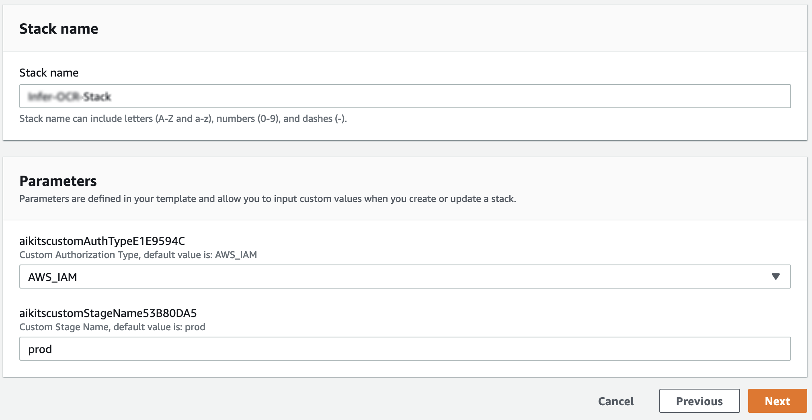

## 背景

本部署指南详细描述了如何在云上使用 Amazon Web Service CloudFormation 模板部署 **AI 解决方案合集 - 图像超分辨率方案**

AI 解决方案合集提供了一系列云上 AI 功能，这些 AI 功能都以 API 的形式提供，客户可以直接调用 API 或使用软件开发工具包（SDK）调用其服务。其中，图像超分辨率方案基于 AI 推理，可将图片进行智能放大2到4倍，并保持结果图像的清晰度，从而获取清晰度更高、细节丰富的图像，解决原始图片分辨率不足的问题。

## 解决方案描述

用户基于Amazon Cloudformartion部署后可以通过调用 HTTP(s) 或 API接口等 方式使用。其中，通过 Amazon API Gateway 创建的 REST API 接口向用户提供 AI 调用服务，用户可以将请求（图片或文本）通过  **HTTP POST**  方式发送请求到 Amazon API Gateway，之后由 Amazon API Gateway 调用 Lambda 或 SageMaker Endpoint 完成 AI 推理过程并将推理结果（JSON格式数据）返回给调用发起端。
本方案使用 Lambda 、 Amazon API Gateway 等无服务架构方案，用户无需担心在云中或本地管理和运行服务器或运行时。只需按实际使用量支付费用。

## 使用场景
本解决方案具有处理速度快、价格低、可私有化部署等优势，能有效保护用户隐私数据。可以解决图像放大之后模糊失真的问题，提升细节保持结果图像的清晰度。应用于等多种场景，解决原始图片分辨率不足的问题，大幅提升信息处理效率。

## 系统架构
用户或程序发送 API 请求至 Amazon API Gateway，请求 payload 中需要包含被处理的图片或文字信息，Amazon API Gateway 接收到 HTTP 到请求后，将请求数据发送给对应的 Lambda 函数或 SageMaker Endpoint，从而实现推理过程，并将推理结果（通常为JSON格式数据）返回。

本解决方案架构中包含两类 AI 功能的实现方式

1. 基于 Amazon Lambda 实现： Amazon API Gateway 将接收到的用户请求直接发送给 Lambda 函数，Lambda 函数通过调用存储在 Amazon EFS 里面的模型完成推理计算，最后将结果返回给调用端。

2. 基于 Amazon SageMaker 实现： 首先 API Gateway 将用户请求发送到 Lambda（invoke endpoint）函数，通过 Lambda 调用 SageMaker Endpoint，在 SageMaker 中执行推理过程并返回推理结果。

### 架构图
此解决方案可在由西云数据运营的 Amazon Web Service （宁夏）区域或由光环新网运营的 Amazon Web Service （北京）区域中部署，也可部署在 Amazon Web Service 其他海外区域。


### 组件

Amazon API Gateway

- 本解决方案使用API Gateway路由用户的 **HTTP POST** 请求；
- 同时还可使用API  Gateway中自定义域名来关联用户ICP备案的域名；用户的 **HTTP POST** 请求中可携带图片的base64编码；Amazon Lambda 进行推理运算

Amazon Lambda (基于 Lambda 的架构类型)

- Lambda函数负责处理用户的请求并进行推理运算。

Amazon EFS

- Amazon EFS 存储基于Lambda预训练的机器学习模型，Lambda 函数通过调用存储在 Amazon EFS 里面的模型完成推理计算，最后将结果返回给调用端。

Amazon SageMaker (基于 SageMaker 的架构类型)

- SageMaker负责用户的推理请求，基于SageMaker Endpoint对请求图像进行超分辨率处理，在 SageMaker 中执行推理过程并返回图片的base64编码数据。用户可以根据SageMaker Endpoint的托管机器的工作负载对其进行Auto-Scaling，完成大批量高并发的请求服务。

## 推荐配置
此方案包含基于 Amazon Lambda 函数和基于 Amazon SageMaker GPU/Inf1 实例实现的两种架构设计类型（见系统架构），用户在部署该方案时，只需按实际业务场景选择其中一种进行部署。
Lambda 函数架构为无服务器架构设计，用户只需按实际使用量付费。
SageMaker GPU/Inf1 架构运行于基于Amazon SageMaker 实例的托管服务，旨在提供高可用性，为需要实时预测的用例提供高性能实时推理。

## 快速部署

以下部署说明适用于在由西云数据运营的Amazon Web Services（宁夏）区域或由光环新网运营的Amazon Web Services（北京）区域中部署的解决方案，也适用于 Amazon Web Services 其他海外区域。您可以使用以下链接快速启动一个Amazon CloudFormation堆栈来部署和管理整个方案。

### 部署前提
本解决方案使用 Amazon API Gateway来接收API 调用请求，所以如果您希望在 北京区域 提供无需身份验证即可访问的 API 请求，则需要申请并确保您的Amazon Web Services账号已通过Internet Content Provider (ICP) 备案，80/443端口可以正常开启，具体流程参见[这里](https://s3.cn-north-1.amazonaws.com.cn/sinnetcloud/ICP+recordal/ICP%E5%A4%87%E6%A1%88%E8%AF%B4%E6%98%8E.pdf)。

### 登录到您的账户

使用具有必需权限（例如：*APIGatewayInvokeFullAcces* ）的IAM用户角色，通过https://console.amazonaws.cn 登录到您的中国区域 Amazon Web Services 账户，非中国区域请通过 https://console.aws.amazon.com 登录。

### 启动 CloudFormation 堆栈

打开 Amazon Web Services 管理控制台（如果还没登录则会先跳转到登录页面，登录后进入模板启动页面）。您可以使用控制台右上方的区域选择链接，选择要部署的区域。然后，单击下面的链接以启动 Amazon CloudFormation 模板。

| 快速启动链接                                                                                                                                                                                                                                               | 描述                                        |
| -------------------------------------------------------------------------------------------------------------------------------------------------------------------------------------------------------------------------------------------------------- | ------------------------------------------- |
| [北京区域(GPU)](https://cn-north-1.console.amazonaws.cn/cloudformation/home?region=cn-north-1#/stacks/create/template?stackName=AIKitsSuperResolutionGPUStack&templateURL=https://aws-gcr-solutions.s3.cn-north-1.amazonaws.com.cn/Aws-gcr-ai-solution-kit/v1.0.0/AIKits-Super-Resolution-GPU-Stack.template)            |  在**北京**区域部署AI Solution Kit - 图像超分辨率解决方案 - 基于 SageMaker GPU 高性能实例架构 |
| [宁夏区域(GPU)](https://cn-northwest-1.console.amazonaws.cn/cloudformation/home?region=cn-northwest-1#/stacks/create/template?stackName=AIKitsSuperResolutionGPUStack&templateURL=https://aws-gcr-solutions.s3.cn-north-1.amazonaws.com.cn/Aws-gcr-ai-solution-kit/v1.0.0/AIKits-Super-Resolution-GPU-Stack.template)        |  在**宁夏**区域部署AI Solution Kit - 图像超分辨率解决方案 - 基于 SageMaker GPU 高性能实例架构 |
| [海外区域(Inf1)](https://console.aws.amazon.com/cloudformation/home?region=us-east-1#/stacks/create/template?stackName=AIKitsSuperResolutionInf1Stack&templateURL=https://aws-gcr-solutions.s3.amazonaws.com/Aws-gcr-ai-solution-kit/v1.0.0/AIKits-Super-Resolution-Inf1-Stack.template)                                  |  在**海外**区域部署AI Solution Kit - 图像超分辨率解决方案 - 基于 SageMaker Inf1 高性能实例架构 |
| [北京区域(Lambda)](https://cn-north-1.console.amazonaws.cn/cloudformation/home?region=cn-north-1#/stacks/create/template?stackName=AIKitsSuperResolutionStack&templateURL=https://aws-gcr-solutions.s3.cn-north-1.amazonaws.com.cn/Aws-gcr-ai-solution-kit/v1.0.0/AIKits-Super-Resolution-Stack.template)            |  在**北京**区域部署AI Solution Kit - 图像超分辨率解决方案 - 基于 Lambda 架构 |
| [宁夏区域(Lambda)](https://cn-northwest-1.console.amazonaws.cn/cloudformation/home?region=cn-northwest-1#/stacks/create/template?stackName=AIKitsSuperResolutionStack&templateURL=https://aws-gcr-solutions.s3.cn-north-1.amazonaws.com.cn/Aws-gcr-ai-solution-kit/v1.0.0/AIKits-Super-Resolution-Stack.template)        |  在**宁夏**区域部署AI Solution Kit - 图像超分辨率解决方案 - 基于 Lambda 架构 |
| [海外区域(Lambda)](https://console.aws.amazon.com/cloudformation/home?region=us-east-1#/stacks/create/template?stackName=AIKitsSuperResolutionStack&templateURL=https://aws-gcr-solutions.s3.amazonaws.com/Aws-gcr-ai-solution-kit/v1.0.0/AIKits-Super-Resolution-Stack.template)                                  |  在**海外**区域部署AI Solution Kit - 图像超分辨率解决方案 - 基于 Lambda 架构 |


| 模版链接                                                                                                                                                                       |
| ----------------------------------------------------------------------------------------------------------------------------------------------------------------------------- |
| [AIKits-Super-Resolution-Stack.template](https://aws-gcr-solutions.s3.amazonaws.com/Aws-gcr-ai-solution-kit/v1.0.0/AIKits-Super-Resolution-Stack.template) |
| [AIKits-Super-Resolution-Inf1-Stack.template](https://aws-gcr-solutions.s3.amazonaws.com/Aws-gcr-ai-solution-kit/v1.0.0/AIKits-Super-Resolution-Inf1-Stack.template) |
| [AIKits-Super-Resolution-GPU-Stack.template](https://aws-gcr-solutions.s3.amazonaws.com/Aws-gcr-ai-solution-kit/v1.0.0/AIKits-Super-Resolution-GPU-Stack.template) |

在默认情况下，该模板将在您登录控制台后后默认的区域启动。若需在指定的Amazon Web Service区域中启动该解决方案，请在控制台导航栏中的区域下拉列表中选择。

在创建堆栈页面上，确认Amazon S3 URL文本框中显示正确的模板URL，然后单击Next按钮。


在Stack name文本框中填写/确认堆栈名称，然后单击Next按钮。

参数说明

|  参数名称   |  默认值 |  描述 |
|  ----------  | ---------| -----------  |
| **customStageName**  | prod | API网关（URI）中的第一个路径字段。请参考：[阶段变量](https://docs.aws.amazon.com/zh_cn/apigateway/latest/developerguide/stage-variables.html)|
| **customAuthType**    | AWS_IAM    | API网关的认证方式. 默认为 *AWS_IAM* ，将自动使用 [IAM](https://docs.aws.amazon.com/zh_cn/apigateway/latest/developerguide/permissions.html) 权限控制对 API 的访问。也可选择 *NONE* 即无权限认证方式（不安全的），在部署解决方案后用户需要手动在 API Gateway 控制台配置所需的[资源访问策略](https://docs.aws.amazon.com/zh_cn/apigateway/latest/developerguide/apigateway-control-access-to-api.html)。 |
| **deployInstanceType**  | N/A | 请选择相应的 Amazon SageMaker 实例类型(粗体为默认值)，<br>GPU 类型可选实例类型：<br>**ml.g4dn.xlarge**, ml.g4dn.2xlarge, ml.g4dn.8xlarge<br>Inf1 类型可选实例类型：<br>**ml.inf1.xlarge**, ml.inf1.2xlarge, ml.inf1.6xlarge|



在审核页面上，查看并确认设置。确保选中确认模板将创建Amazon Identity and Access Management（IAM）资源的复选框。


单击 Create stack 按钮以部署堆栈。
您可以在Amazon CloudFormation控制台的状态列中查看堆栈的状态。您应该在大约15分钟内看到状态成为**CREATE_COMPLETE**。


在堆栈创建成功后，可在Amazon CloudFormation的Outputs标签页中看到以 **aikitsInvokeURL** 开头的记录，请记住后面的URL。


## 开始使用

### 调用 URL

您可以在 Amazon CloudFormation 的 Outputs 标签页中看到以 **aikitsInvokeURL** 为前缀的记录的 URL 。

### REST API接口参考

- HTTP 方法: `POST`

- Body 请求参数

| **名称**  | **类型**  | **是否必选** |  **说明**  |
|----------|-----------|------------|------------|
|url&nbsp;&nbsp;&nbsp;&nbsp;       |*String*     |与 img 参数二选一，优先级高于 img|图像的 URL 地址。支持 HTTP/HTTPS 和 S3 协议。要求图像格式为 jpg/jpeg/png/bmp ，图像大小建议不超过1920 * 1080，在开启人像增强的情况下，图像大小建议不超过1280 * 720。Lambda 版本方案由于性能限制，图像大小建议不超过400 * 400|
|img       |*String*     |与 url 参数二选一|进行 base64 编码的图像数据|
|scale     |*Integer*    |否|图像放大倍数，支持放大倍数为2或4，默认值为2|
|face      |*Bool*       |否|当True时，额外开启人脸增强，默认值为False。（仅支持 **GPU** 版本部署方式）|

- 请求 Body 示例

``` json
{
  "url": "https://aikits.demo.solutions.aws.a2z.org.cn/img/sr-5.jpg",
  "scale" : 2
}
```

``` json
{
  "img": "/9j/4AAQSkZJRgABAQEAYABgAAD/2wBDAAgGBgcGBQgHBwcJCQgKDBQNDAsLDBkSEw8UHRofHh0aHBwgJC4nICIsIxwcKDcpLDAxNDQ0Hyc5PTgyPC4zNDL/……",
  "scale" : 4
}
```

- 返回参数

| **名称**  | **类型**  |  **说明**  |
|----------|-----------|------------|
|result    |*String*   |按比例放大后 base64 编码的图像数据|

- 返回示例
``` json
{
    "result": "/9j/4AAQSkZJRgABAQEAYABgAAD/2wBDAAgGBgcGBQgHBwcJCQgKDBQNDAsLDBkSEw8UHRofHh0aHBwgJC4nICIsIxwcKDcpLDAxNDQ0Hyc5PTgyPC4zNDL/……"
}
```

###  请求代码示例

以下代码示例均为无认证方式部署模式后的测试方式，如果您选择 AWS_IAM 方式部署本方案，请参考 Postman 方式。

**cURL**
``` bash
curl --location --request POST 'https://xxxxxxxxxxx.execute-api.xxxxxxxxx.amazonaws.com/prod/resolution' \
--header 'Content-Type: application/json' \
--data-raw '{
  "url":"https://aikits.demo.solutions.aws.a2z.org.cn/img/sr-5.jpg"
}'
```

**Python (requests)**
``` python
import requests
import json

url = "https://xxxxxxxxxxx.execute-api.xxxxxxxxx.amazonaws.com/prod/resolution"

payload = json.dumps({
  "url": "https://aikits.demo.solutions.aws.a2z.org.cn/img/sr-5.jpg"
})
headers = {
  'Content-Type': 'application/json'
}

response = requests.request("POST", url, headers=headers, data=payload)

print(response.text)

```

**Java (OkHttp)**
``` java
OkHttpClient client = new OkHttpClient().newBuilder()
  .build();
MediaType mediaType = MediaType.parse("application/json");
RequestBody body = RequestBody.create(mediaType, "{\n  \"url\":\"https://aikits.demo.solutions.aws.a2z.org.cn/img/sr-5.jpg\"\n}");
Request request = new Request.Builder()
  .url("https://xxxxxxxxxxx.execute-api.xxxxxxxxx.amazonaws.com/prod/resolution")
  .method("POST", body)
  .addHeader("Content-Type", "application/json")
  .build();
Response response = client.newCall(request).execute();
```

**PHP (curl)**
``` php
<?php

$curl = curl_init();

curl_setopt_array($curl, array(
  CURLOPT_URL => 'https://xxxxxxxxxxx.execute-api.xxxxxxxxx.amazonaws.com/prod/resolution',
  CURLOPT_RETURNTRANSFER => true,
  CURLOPT_ENCODING => '',
  CURLOPT_MAXREDIRS => 10,
  CURLOPT_TIMEOUT => 0,
  CURLOPT_FOLLOWLOCATION => true,
  CURLOPT_HTTP_VERSION => CURL_HTTP_VERSION_1_1,
  CURLOPT_CUSTOMREQUEST => 'POST',
  CURLOPT_POSTFIELDS =>'{
  "url":"https://aikits.demo.solutions.aws.a2z.org.cn/img/sr-5.jpg"
}',
  CURLOPT_HTTPHEADER => array(
    'Content-Type: application/json'
  ),
));

$response = curl_exec($curl);

curl_close($curl);
echo $response;
```

### 在 Postman 中以 IAM 方式请求 URL

在Postman中新建标签页，并把上一步中的API调用URL粘贴到地址栏。选择POST作为HTTP调用方法。


打开Authorization配置，在下拉列表里选择 Amazon Web Service Signature ，并填写对应账户的AccessKey、SecretKey和AWS Region（如 cn-north-1 或 cn-northwest-1 ）。


打开 Body 配置项，选中raw和JSON数据类型。在Body中输入测试数据，单击Send按钮即可看到相应结果。

``` json
{
  "url": "https://aikits.demo.solutions.aws.a2z.org.cn/img/sr-5.jpg"
}
```

### 创建和使用带 API 密钥的使用计划

本解决方案支持 API 使用计划（Usage Plans）。部署本解决方案并测试 API 后，您可以实施 API Gateway 使用计划，将它们作为面向客户的产品/服务提供。您可以配置使用计划和 API 密钥，以允许客户按照商定的可满足其业务需求和预算限制的请求速率和配额来访问选定 API。如果需要，您可以为 API 设置默认方法级别限制或为单个 API 方法设置限制。 API 调用方必须在 API 请求的 x-api-key 标头中提供一个已分配的 API 密钥。 

如您需要配置 *API 使用计划* 请参考：[配置使用计划](https://docs.aws.amazon.com/zh_cn/apigateway/latest/developerguide/api-gateway-create-usage-plans.html)


## 卸载部署

您可以通过Amazon CloudFormation卸载对应的堆栈，整个删除过程大约需要10分钟。


