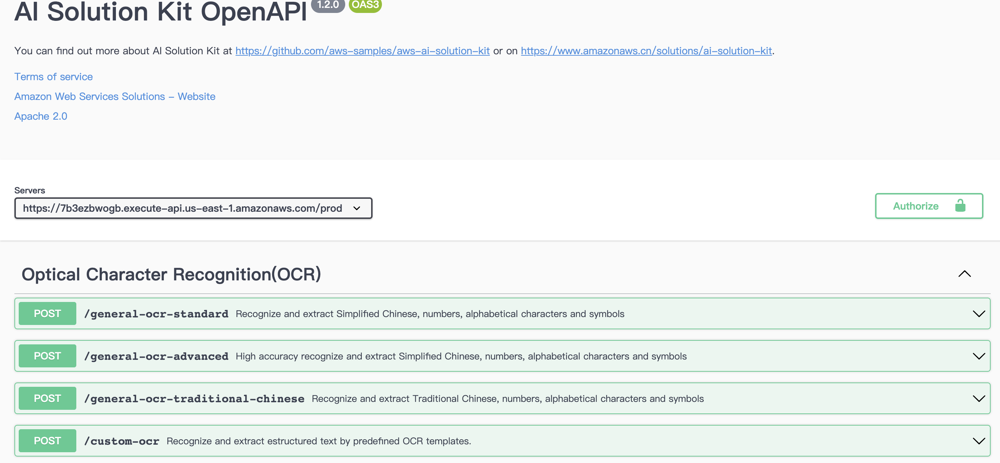

## 开始使用

### API资源浏览器

**前提条件**

通过AWS CloudFormation[部署解决方案](deployment.md#amazon-cloudformation)时，您需要：

- 设置参数**API Explorer**为*yes*。
- 设置参数**API Gateway Authorization**为*NONE*。

否则，在API资源浏览器中只能看到该API的参考定义，而不能进行在线测试等操作。

**操作步骤**

1. 访问[AWS CloudFormation控制台](https://console.aws.amazon.com/cloudformation/)。
2. 从堆栈列表中选择方案的根堆栈。
3. 打开**输出**标签页，找到**APIExplorer**对应的URL。
4. 点击URL访问API资源浏览器。页面将显示在部署解决方案时选中的API。
    
    

5. 点击API右侧的向下箭头，展开显示API标准模型的请求方法。
6. 点击右侧的测试（Try it out）按钮，并在Request body中输入正确的Body请求数据进行测试，并查看测试结果。
7. 确认格式正确后，点击下方的**Execute**。
8. 在**Responses body**中查看返回的JSON结果。您还可以通过右侧复制或下载按钮保存处理结果。
9. 在**Response headers**中查看响应头的相关信息。
10. （可选）点击**Execute**右侧**Clear**按钮，即可清空**Request body**与**Responses**测试结果。

### Postman（*AWS_IAM*认证）

1. 访问[AWS CloudFormation](https://console.aws.amazon.com/cloudformation/)控制台。
2. 从堆栈列表中选择方案的根堆栈。
3. 打开**输出**标签页，找到以 **{{ page.meta.feature_id }}** 为前缀的URL。
4. 在Postman中新建标签页，并把URL粘贴到地址栏，选择*POST*作为HTTP调用方法。

    

5. 打开Authorization配置，在下拉列表里选择Amazon Web Service Signature，并填写对应账户的AccessKey、SecretKey和Amazon Web Service Region（例如，cn-north-1或cn-northwest-1）。

    

6. 打开Body配置项，选中raw和JSON数据类型。

7. 在Body中输入测试数据，单击Send按钮即可看到相应返回结果。

``` json
{
  "url": "{{page.meta.sample_image}}"
}
```


### cURL
``` bash
curl --location --request POST 'https://[API_ID].execute-api.[AWS_REGION].amazonaws.com/[STAGE]/{{page.meta.feature_endpoint}}' \
--header 'Content-Type: application/json' \
--data-raw '{
  "url":"{{page.meta.sample_image}}"
}'
```

### Python（*AWS_IAM*认证）
``` python
import requests
import json
from aws_requests_auth.boto_utils import BotoAWSRequestsAuth

auth = BotoAWSRequestsAuth(aws_host='[API_ID].execute-api.[AWS_REGION].amazonaws.com',
                           aws_region='[AWS_REGION]',
                           aws_service='execute-api')

url = 'https://[API_ID].execute-api.[AWS_REGION].amazonaws.com/[STAGE]/{{page.meta.feature_endpoint}}'
payload = {
    'url': '{{page.meta.sample_image}}'
}
response = requests.request("POST", url, data=json.dumps(payload), auth=auth)
print(json.loads(response.text))
```

### Python（*NONE*认证）
``` python
import requests
import json

url = "https://[API_ID].execute-api.[AWS_REGION].amazonaws.com/[STAGE]/{{page.meta.feature_endpoint}}"

payload = json.dumps({
  "url": "{{page.meta.sample_image}}"
})
headers = {
  'Content-Type': 'application/json'
}

response = requests.request("POST", url, headers=headers, data=payload)

print(response.text)
```

### Java
``` java
OkHttpClient client = new OkHttpClient().newBuilder()
  .build();
MediaType mediaType = MediaType.parse("application/json");
RequestBody body = RequestBody.create(mediaType, "{\n  \"url\":\"{{page.meta.sample_image}}\"\n}");
Request request = new Request.Builder()
  .url("https://xxxxxxxxxxx.execute-api.xxxxxxxxx.amazonaws.com/[STAGE]/{{page.meta.feature_endpoint}}")
  .method("POST", body)
  .addHeader("Content-Type", "application/json")
  .build();
Response response = client.newCall(request).execute();
```

